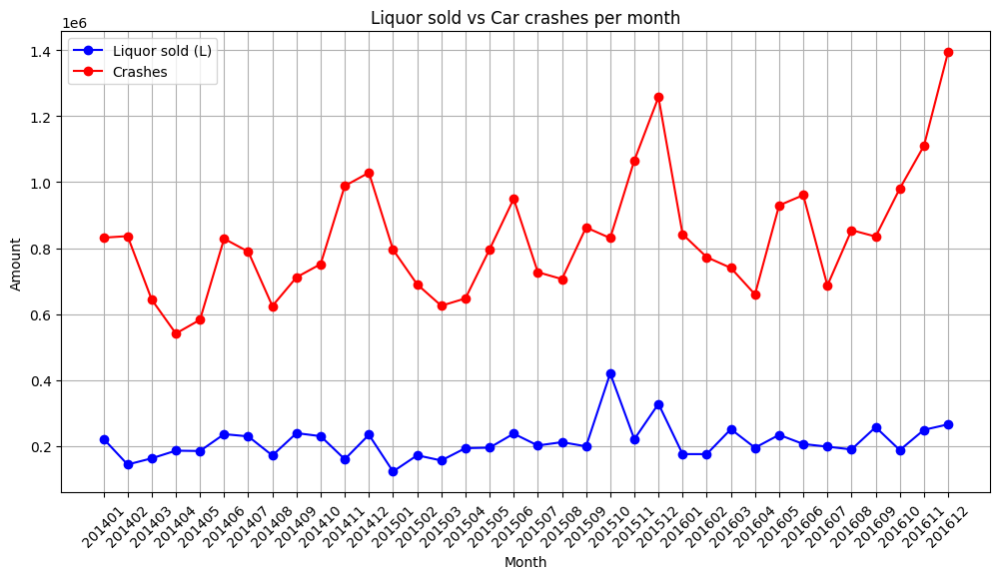

```python
from pyspark.sql.functions import to_date

from pyspark.sql import SparkSession
spark = SparkSession.builder.appName("Iowa2025").config("spark.memory.offHeap.enabled", "true").config(
    "spark.memory.offHeap.size", "10g").config('spark.sql.catalogImplementation', 'hive').config('spark.sql.legacy.createHiveTableByDefault', 'false').getOrCreate()

spark.sparkContext.setLogLevel("ERROR")
```


```python
crashes = spark.read.csv("data/Crashes_in_Iowa_by_Severity_and_Day_20250220.csv", header=True, inferSchema=True)

crashes = crashes.withColumn("Date of Crash", to_date(crashes["Date of Crash"], "MM/dd/yyyy"))

```


```python
crashes.show(5)
crashes.createOrReplaceTempView("crashes")
spark.sql("SELECT * FROM crashes LIMIT 5").show()
```

    +-------------+--------------------+-------+
    |Date of Crash|      Crash Severity|Crashes|
    +-------------+--------------------+-------+
    |   2014-01-01|    Possible/Unknown|     22|
    |   2014-01-01|        Minor Injury|     11|
    |   2014-01-01|Property Damage Only|    186|
    |   2014-01-01|        Major Injury|      6|
    |   2014-01-02|Property Damage Only|    142|
    +-------------+--------------------+-------+
    only showing top 5 rows
    
    +-------------+--------------------+-------+
    |Date of Crash|      Crash Severity|Crashes|
    +-------------+--------------------+-------+
    |   2014-01-01|    Possible/Unknown|     22|
    |   2014-01-01|        Minor Injury|     11|
    |   2014-01-01|Property Damage Only|    186|
    |   2014-01-01|        Major Injury|      6|
    |   2014-01-02|Property Damage Only|    142|
    +-------------+--------------------+-------+


```python
liquorSales = spark.read.csv("./data/Iowa_Liquor_Sales_sample.csv", header=True, inferSchema=True)

liquorSales = liquorSales.withColumn("Date", to_date(liquorSales["Date"], "MM/dd/yyyy"))

liquorSales.createOrReplaceTempView("liquorSales")
```


```python
liquorSales.show(5)
```

    +-------------------+----------+------------+--------------------+--------------------+-------------+--------+--------------------+-------------+---------+--------+--------------------+-------------+--------------------+-----------+--------------------+----+------------------+-----------------+-------------------+------------+--------------+--------------------+---------------------+
    |Invoice/Item Number|      Date|Store Number|          Store Name|             Address|         City|Zip Code|      Store Location|County Number|   County|Category|       Category Name|Vendor Number|         Vendor Name|Item Number|    Item Description|Pack|Bottle Volume (ml)|State Bottle Cost|State Bottle Retail|Bottles Sold|Sale (Dollars)|Volume Sold (Liters)|Volume Sold (Gallons)|
    +-------------------+----------+------------+--------------------+--------------------+-------------+--------+--------------------+-------------+---------+--------+--------------------+-------------+--------------------+-----------+--------------------+----+------------------+-----------------+-------------------+------------+--------------+--------------------+---------------------+
    |       S07829500020|2012-09-19|        2600|HY-VEE FOOD STORE...|      110  SO  D  ST|    OSKALOOSA|   52577|                NULL|           62|  MAHASKA| 1032080|     IMPORTED VODKAS|          370|PERNOD RICARD USA...|      34041|ABSOLUT VODKA 100...|  12|               750|             15.0|              22.49|           4|         89.96|                 3.0|                 0.79|
    |       S26982900006|2014-07-28|        4255|FAREWAY STORES #0...|         512  8TH SE|  ORANGE CITY|   51041|                NULL|           84|    SIOUX| 1031080|      VODKA 80 PROOF|          297|   LAIRD AND COMPANY|      35918|  FIVE O'CLOCK VODKA|   6|              1750|              7.2|               10.8|          12|         129.6|                21.0|                 5.55|
    |       S06914600084|2014-08-02|        2625|HY-VEE WINE AND S...|  3301 W KIMBERLY RD|    DAVENPORT|   52804|                NULL|           82|    SCOTT| 1011200|STRAIGHT BOURBON ...|           65|     JIM BEAM BRANDS|      19476|        MAKER'S MARK|  12|               750|            15.74|              23.61|           1|         23.61|                0.75|                  0.2|
    |       S07447000040|2014-08-30|        3773|   BENZ DISTRIBUTING|      501 7TH AVE SE| CEDAR RAPIDS|   52401|POINT (-91.659875...|           57|     LINN| 1012200|     SCOTCH WHISKIES|           55|SAZERAC NORTH AME...|       8827|            LAUDER'S|  12|              1000|             6.07|                9.1|          12|         109.2|                12.0|                 3.17|
    |       S26897300054|2014-07-28|        5104|RUSTIC LURE WINE ...|72, N OKOBOJI GRO...|ARNOLD'S PARK|   51331|                NULL|           30|DICKINSON| 1031080|      VODKA 80 PROOF|          260|     DIAGEO AMERICAS|      37997|SMIRNOFF VODKA 80...|  12|              1000|             9.25|              13.88|           6|         83.28|                 6.0|                 1.59|
    +-------------------+----------+------------+--------------------+--------------------+-------------+--------+--------------------+-------------+---------+--------+--------------------+-------------+--------------------+-----------+--------------------+----+------------------+-----------------+-------------------+------------+--------------+--------------------+---------------------+


```python
liquorAndCrashes = spark.sql("SELECT ROUND(SUM(`Volume Sold (liters)`)) AS liquorSold, SUM(c.Crashes) as Crashes, date_format(l.`Date`, 'yyyyMM') AS monthOfYear FROM liquorSales l, crashes c WHERE date_format(l.`Date`, 'yyyyMM') = date_format(c.`Date of Crash`, 'yyyyMM') AND date_format(l.`Date`, 'yyyy') BETWEEN '2014' AND '2016' GROUP BY date_format(l.`Date`, 'yyyyMM')  ORDER BY date_format(l.`Date`, 'yyyyMM')")

```


```python
liquorAndCrashes.show()
```

    +----------+-------+-----------+
    |liquorSold|Crashes|monthOfYear|
    +----------+-------+-----------+
    |  222340.0| 831810|     201401|
    |  144190.0| 836528|     201402|
    |  162964.0| 643986|     201403|
    |  186178.0| 541336|     201404|
    |  185184.0| 582860|     201405|
    |  236250.0| 828738|     201406|
    |  229508.0| 789392|     201407|
    |  171569.0| 624676|     201408|
    |  239364.0| 711744|     201409|
    |  230142.0| 751680|     201410|
    |  160180.0| 988696|     201411|
    |  234457.0|1028817|     201412|
    |  122961.0| 795468|     201501|
    |  172127.0| 690300|     201502|
    |  156422.0| 625430|     201503|
    |  193815.0| 647680|     201504|
    |  195261.0| 796168|     201505|
    |  237702.0| 949584|     201506|
    |  201819.0| 727207|     201507|
    |  211978.0| 706266|     201508|
    +----------+-------+-----------+


```python
import matplotlib.pyplot as plt
liquorAndCrashesData = liquorAndCrashes.toPandas()
```


```python
plt.figure(figsize=(12, 6))
plt.plot(liquorAndCrashesData['monthOfYear'], liquorAndCrashesData['liquorSold'], marker='o', linestyle='-', color='b', label='Liquor sold (L)')
plt.plot(liquorAndCrashesData['monthOfYear'], liquorAndCrashesData['Crashes'], marker='o', linestyle='-', color='r', label='Crashes')
plt.title('Liquor sold vs Car crashes per month')
plt.xlabel('Month')
plt.ylabel('Amount')
plt.xticks(rotation=45)
plt.legend()
plt.grid(True)
plt.show()
```


    


```python

```
